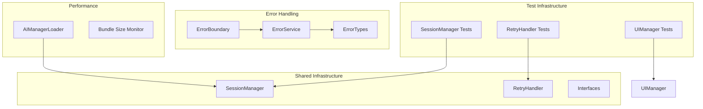
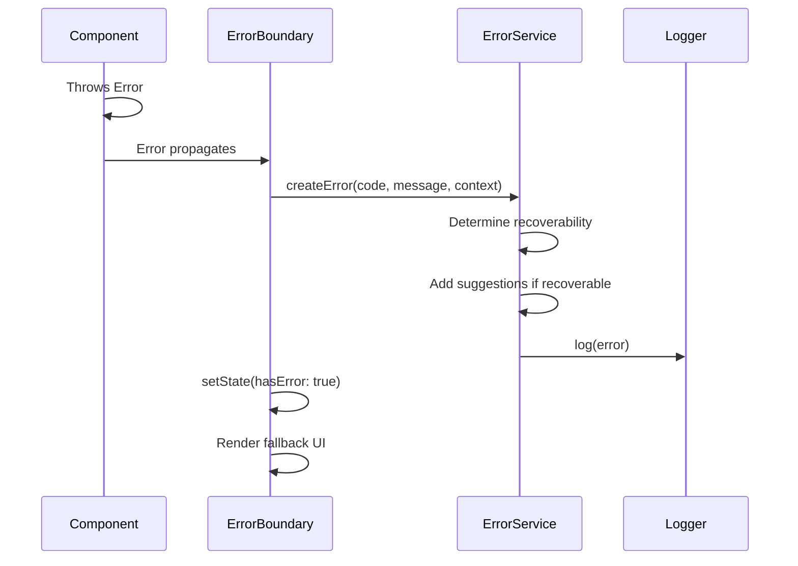

# Design Document

## Overview

This design document outlines the technical approach for implementing the next development phase improvements for the Reflexa AI Chrome Extension. The improvements focus on test coverage, documentation, error handling, performance optimization, and CI/CD enhancements. All implementations follow the SOLID principles established during the recent refactoring.

## Architecture

The improvements integrate with the existing architecture without requiring structural changes:



## Components and Interfaces

### Test Infrastructure

#### SessionManager Tests
Tests for the generic SessionManager class covering:
- Session creation and caching
- Session retrieval
- Session destruction (single and all)
- Error handling during session operations

#### RetryHandler Tests
Tests for the RetryHandler class covering:
- Successful first attempt
- Successful retry after failure
- Failed retry scenarios
- Timeout handling

#### UIManager Tests
Tests for the UIManager class covering:
- Modal show/hide lifecycle
- Shadow DOM creation
- Duplicate prevention
- Cleanup functionality

### Error Handling Components

#### ErrorService Interface
```typescript
interface IErrorService {
  createError(code: ErrorCode, message: string, context?: ErrorContext): StandardError;
  formatForUser(error: StandardError): string;
  log(error: StandardError): void;
  isRecoverable(error: StandardError): boolean;
}
```

#### StandardError Type
```typescript
interface StandardError {
  code: ErrorCode;
  message: string;
  context?: Record<string, unknown>;
  suggestions?: string[];
  recoverable: boolean;
  timestamp: number;
}

type ErrorCode = 
  | 'AI_UNAVAILABLE'
  | 'SESSION_CREATE_FAILED'
  | 'OPERATION_TIMEOUT'
  | 'NETWORK_ERROR'
  | 'UNKNOWN_ERROR';
```

#### ErrorBoundary Component
```typescript
interface ErrorBoundaryProps {
  children: ReactNode;
  fallback?: ReactNode;
  onError?: (error: Error, errorInfo: ErrorInfo) => void;
  onRetry?: () => void;
}
```

### Performance Components

#### AIManagerLoader Interface
```typescript
interface IAIManagerLoader {
  getWriter(): Promise<WriterManager>;
  getRewriter(): Promise<RewriterManager>;
  getProofreader(): Promise<ProofreaderManager>;
  getTranslator(): Promise<TranslatorManager>;
  getSummarizer(): Promise<SummarizerManager>;
  preload(managers: ManagerType[]): Promise<void>;
}
```

#### Bundle Size Configuration
```typescript
interface BundleSizeConfig {
  thresholds: {
    content: number;    // bytes
    background: number; // bytes
    popup: number;      // bytes
  };
  warnOnIncrease: boolean;
  failOnExceed: boolean;
}
```

## Data Models

### Test Mocks

#### MockSession
```typescript
interface MockSession {
  id: string;
  destroy: () => void;
  destroyed: boolean;
}
```

#### MockOperation
```typescript
type MockOperation<T> = {
  result: T;
  shouldFail: boolean;
  failCount: number;
  delay: number;
};
```

### Error Context
```typescript
interface ErrorContext {
  operation?: string;
  manager?: string;
  sessionKey?: string;
  attemptNumber?: number;
  originalError?: Error;
}
```

## Correctness Properties

*A property is a characteristic or behavior that should hold true across all valid executions of a system-essentially, a formal statement about what the system should do. Properties serve as the bridge between human-readable specifications and machine-verifiable correctness guarantees.*

### SessionManager Properties

**Property 1: Session creation stores and returns instance**
*For any* session key and factory function that returns a valid session, when getOrCreate is called, the SessionManager should store the session in its cache and return the same session instance.
**Validates: Requirements 1.1**

**Property 2: Cached session retrieval skips factory**
*For any* session key that already exists in the cache, when getOrCreate is called again, the SessionManager should return the cached session without invoking the factory function.
**Validates: Requirements 1.2**

**Property 3: Session destruction calls destroy and removes from cache**
*For any* session key that exists in the cache, when destroy is called, the SessionManager should call the session's destroy method and the session should no longer exist in the cache.
**Validates: Requirements 1.3**

**Property 4: DestroyAll destroys all sessions**
*For any* set of sessions in the cache, when destroyAll is called, every session's destroy method should be called and the cache should be empty.
**Validates: Requirements 1.4**

### RetryHandler Properties

**Property 5: Successful operation returns result without retry**
*For any* operation that succeeds on the first attempt, the RetryHandler should return the result and the operation should only be called once.
**Validates: Requirements 1.5**

**Property 6: Failed then successful operation returns retry result**
*For any* operation that fails on the first attempt but succeeds on retry, the RetryHandler should return the result from the retry attempt.
**Validates: Requirements 1.6**

**Property 7: Double failure throws formatted error**
*For any* operation that fails on both attempts, the RetryHandler should throw an error containing the error prefix and the underlying error message.
**Validates: Requirements 1.7**

**Property 8: Timeout rejection**
*For any* operation that takes longer than the specified timeout, the RetryHandler should reject with a timeout error before the operation completes.
**Validates: Requirements 1.8**

### UIManager Properties

**Property 9: Modal show creates shadow DOM and renders component**
*For any* modal type and React component, when showModal is called, a shadow DOM container should be created in the document body and the component should be rendered within it.
**Validates: Requirements 2.1**

**Property 10: Duplicate modal prevention (Idempotence)**
*For any* modal type that is already visible, calling showModal again should not create additional containers - the container count should remain the same.
**Validates: Requirements 2.2**

**Property 11: Modal hide removes container from DOM**
*For any* visible modal, when hideModal is called, the container should be removed from the document body and the React root should be unmounted.
**Validates: Requirements 2.3**

**Property 12: Cleanup hides all modals**
*For any* set of visible modals, when cleanup is called, all modal containers should be removed from the DOM.
**Validates: Requirements 2.4**

### ErrorService Properties

**Property 13: Error creation produces standardized object**
*For any* error code, message, and optional context, the ErrorService should create an error object containing all required fields (code, message, recoverable, timestamp).
**Validates: Requirements 4.1**

**Property 14: Recoverable errors include suggestions**
*For any* error that is marked as recoverable, the created error object should include a non-empty suggestions array.
**Validates: Requirements 4.2**

**Property 15: User-friendly formatting hides technical details**
*For any* StandardError object, the formatted user message should not contain stack traces, internal error codes, or implementation details.
**Validates: Requirements 4.4**

### AIManagerLoader Properties

**Property 16: Manager caching returns same instance**
*For any* manager type, subsequent calls to get that manager should return the exact same instance (referential equality).
**Validates: Requirements 6.2**

**Property 17: Concurrent requests share promise**
*For any* manager type with multiple simultaneous requests, all requests should receive the same promise, preventing duplicate module loading.
**Validates: Requirements 6.3**

### ErrorBoundary Properties

**Property 18: Error boundary catches child errors**
*For any* React component that throws an error, when wrapped in an ErrorBoundary, the error should be caught and the fallback UI should be displayed instead of crashing.
**Validates: Requirements 7.1**

**Property 19: Recoverable errors show retry action**
*For any* error that is recoverable, the ErrorBoundary fallback UI should include a retry button/action.
**Validates: Requirements 7.3**

## Error Handling

### Error Categories

| Category | Error Codes | Recoverable | User Message |
|----------|-------------|-------------|--------------|
| AI Availability | AI_UNAVAILABLE | Yes | "AI features are temporarily unavailable. Please try again." |
| Session | SESSION_CREATE_FAILED | Yes | "Unable to start AI session. Please retry." |
| Timeout | OPERATION_TIMEOUT | Yes | "The operation took too long. Please try again." |
| Network | NETWORK_ERROR | Yes | "Network connection issue. Please check your connection." |
| Unknown | UNKNOWN_ERROR | No | "An unexpected error occurred." |

### Error Flow



## Testing Strategy

### Dual Testing Approach

This implementation uses both unit tests and property-based tests:

- **Unit tests**: Verify specific examples, edge cases, and integration points
- **Property-based tests**: Verify universal properties that should hold across all valid inputs

### Property-Based Testing Framework

**Framework**: fast-check (npm package)

fast-check is chosen because:
- Native TypeScript support
- Excellent shrinking for minimal failing examples
- Rich set of built-in arbitraries
- Good integration with Vitest

### Test Configuration

Each property-based test will:
- Run a minimum of 100 iterations
- Be tagged with the format: `**Feature: next-phase-improvements, Property {number}: {property_text}**`
- Reference the specific correctness property from this design document

### Test File Structure

```
src/
├── background/services/ai/shared/
│   ├── SessionManager.test.ts      # Properties 1-4
│   ├── RetryHandler.test.ts        # Properties 5-8
│   └── __tests__/
│       └── shared.property.test.ts # PBT for shared infrastructure
├── content/ui/
│   └── uiManager.test.ts           # Properties 9-12
├── services/error/
│   ├── ErrorService.ts
│   ├── ErrorService.test.ts        # Properties 13-15
│   └── ErrorBoundary.test.tsx      # Properties 18-19
└── background/services/ai/
    └── AIManagerLoader.test.ts     # Properties 16-17
```

### Test Generators (fast-check Arbitraries)

```typescript
// Session key generator
const sessionKeyArb = fc.string({ minLength: 1, maxLength: 50 });

// Mock session generator
const mockSessionArb = fc.record({
  id: fc.uuid(),
  destroyed: fc.constant(false),
});

// Error code generator
const errorCodeArb = fc.constantFrom(
  'AI_UNAVAILABLE',
  'SESSION_CREATE_FAILED', 
  'OPERATION_TIMEOUT',
  'NETWORK_ERROR',
  'UNKNOWN_ERROR'
);

// Timeout values generator
const timeoutArb = fc.integer({ min: 10, max: 5000 });
```

### Coverage Targets

| Component | Line Coverage | Branch Coverage |
|-----------|--------------|-----------------|
| SessionManager | 100% | 100% |
| RetryHandler | 100% | 100% |
| UIManager | 90% | 85% |
| ErrorService | 100% | 100% |
| AIManagerLoader | 95% | 90% |
| ErrorBoundary | 90% | 85% |

